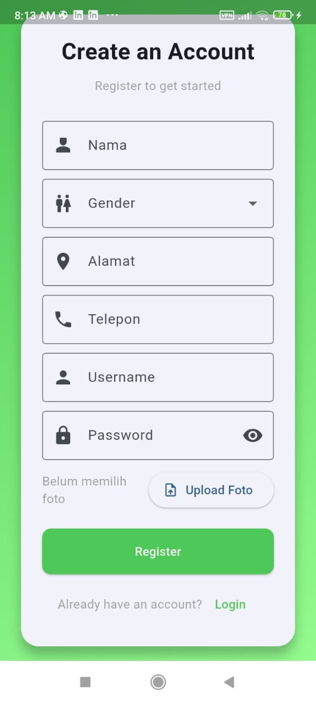
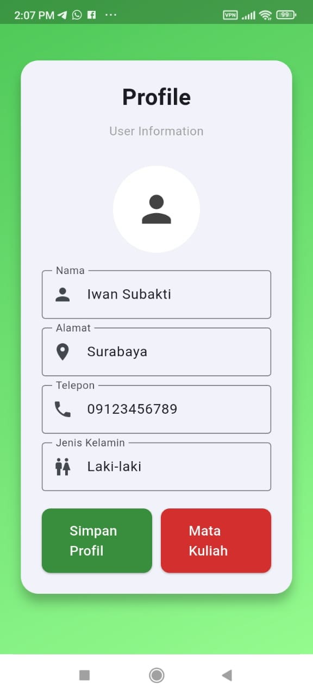

# Project UKL 1

## 1. Halaman Registrasi
* Fitur Utama:

    * Form pendaftaran dengan field lengkap:

        * Nama lengkap

        * Jenis kelamin (dropdown)

        * Alamat

        * Nomor telepon

        * Username

        * Password

    * Validasi data sebelum dikirim ke server

    * Konfirmasi registrasi berhasil

## 2. Halaman Login
* Fitur Utama:

    * Input username dan password

    * Validasi form sebelum login

    * Tombol navigasi ke halaman registrasi

## 3. Halaman Profil
* Fitur Utama:

    * Menampilkan data pribadi user:

        * Nama

        * Alamat

        * Nomor telepon

        * Jenis kelamin (dropdown)

    * Edit data profil

    * Update foto profil

    * Tombol navigasi ke halaman mata kuliah

## 4 & 5. Halaman Mata Kuliah
* Fitur Utama:

    * Daftar mata kuliah dalam bentuk tabel dengan:

        * Kode mata kuliah

        * Nama mata kuliah

        * Jumlah SKS

        * Checkbox pemilihan

    * Sistem seleksi mata kuliah:

    * Bisa memilih beberapa mata kuliah

    * Indikator visual untuk mata kuliah terpilih (✔)

    * Perhitungan otomatis total SKS terpilih

    * Tombol simpan untuk menyimpan pilihan

Setiap halaman sudah terintegrasi dengan API Laravel untuk operasi CRUD data.

